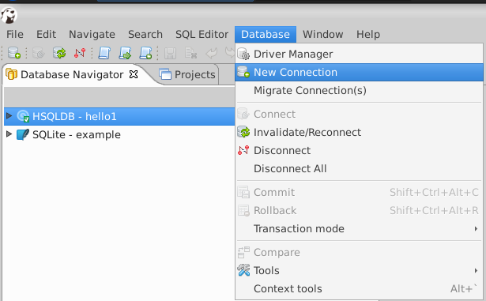
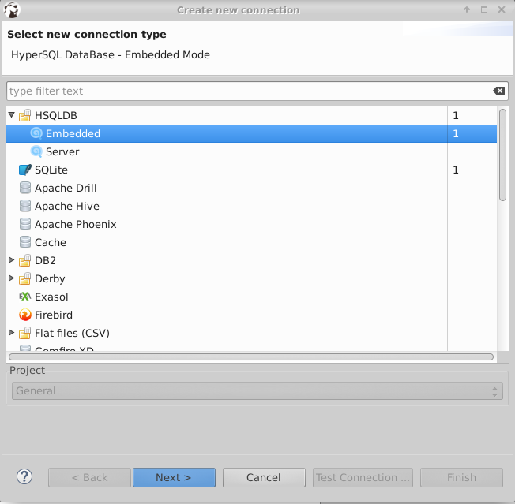
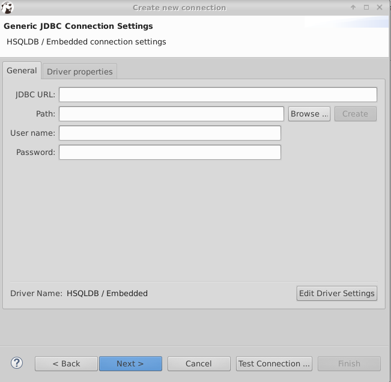
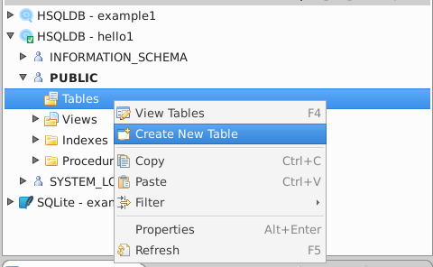
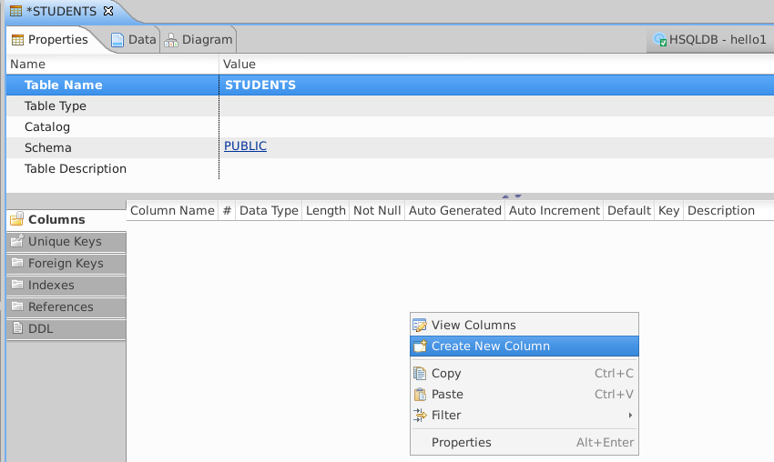
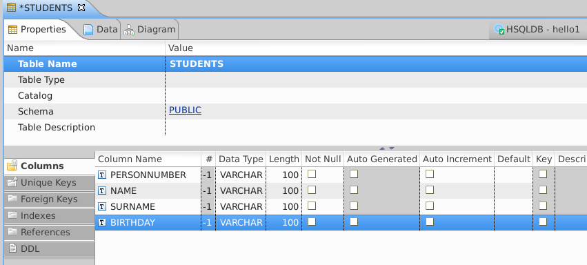
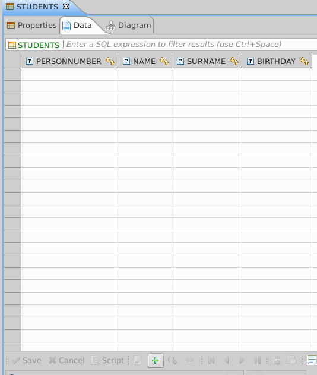
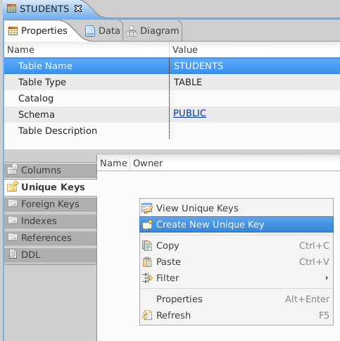
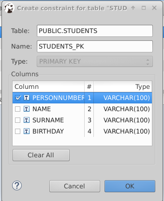

# This is an introduction to Relational Databases and SQL
During this tutorial we will use three SW:
* A Java IDE (e.g. Eclipse)
* http://hsqldb.org/ An embedded Java SQL database (download the latest version from https://sourceforge.net/projects/hsqldb/files/latest/download?source=files)
* http://dbeaver.jkiss.org/download/ A GUI to use and admin databases

The majority of concepts of this tutorial can be applied to other interfaces
and other databases.


# Introduction
Storing and retrieving information (data) is a task common to all applications.
These are two simple examples:

* Management SW
 * Keep the list of employees, their salary, leave of absence
 * Retrieve the employees hired more than four years ago and with few absences to offer them a monetary reward
* University's SW
 * Keep the list of students, courses, grades, …
 * Find all students that passed both “networking” and "computer security” with good grades to offer them a job.

A Database is a large collection of integrated data and models the information belonging to a system.
A Database Management System (DBMS) is a Software designed to store and manage databases. The key idea is that
common functionalities (like how to store, delete, modify, retrieve, sort, filter data, etc) can be written
once, freeing SW developer from reinventing the wheel.


## A sample database
We will use the following running example. A system storing information about KTH.
In this system we have:

* KTH Students
 * have name, surname, nationality, birthday
 * take courses (and eventually get grades)
* KTH professors
 * have name, surname, nationality, birthday, salary
 * teach courses
* KTH courses
 * have name, teaching material
 * are taught by professors and taken by students

## Terminology:
* Students, professors and courses are **entities**
* **Attributes** represent what we know about entities:
 * name, surname, nationality and birthday of students
 * name surname nationality, birthdat, salary of professors
 * name, teaching material of courses
* **Relations** integrate data
 * Who teaches what?
 * Who takes what?

A **relation** ( or **table**) is a multiset of tuples having attributes.
A **multiset** is a unordered list (or set with duplicates).
The following is the student relation:

Name | Surname | Birthday | Nationality
-----|---------|----------|------------
Roberto | Guanciale | 1979-12-08| Italian
Bill | Gates| 1960-08-10 |USA
Erik| Erikson| 1976-11-01| Swedish
Erik| Anderson | 1965-02-05| Swedish
Erik| Doe | 1985-11-01	| USA
Angela| Jordan | 1965-01-11 | German
Riccardo| Mandors| 1985-01-02| Italian

An **attribute** (or **column**) is a (typed) data entry present in each tuple.
Types can be integer, float, double, date, time, string, binary blob (e.g. student selfie), money.
**Birthday** is an attribute of students:

Name | Surname | **Birthday** | Nationality
-----|---------|--------------|------------
Roberto | Guanciale | **1979-12-08**| Italian
Bill | Gates| **1960-08-10** |USA
Erik| Erikson| **1976-11-01**| Swedish
Erik| Anderson | **1965-02-05**| Swedish
Erik| Doe | **1985-11-01**	| USA
Angela| Jordan | **1965-01-11** | German
Riccardo| Mandors| **1985-01-02**| Italian

An **entity** (or **row**) is a single entry in the table having the attributes specified by the schema.
E.g.:

Name | Surname | Birthday | Nationality
-----|---------|----------|------------
Roberto | Guanciale | 1979-12-08| Italian
Bill | Gates| 1960-08-10 |USA
Erik| Erikson| 1976-11-01| Swedish
**Erik**| **Anderson** | **1965-02-05**| **Swedish**
Erik| Doe | 1985-11-01	| USA
Angela| Jordan | 1965-01-11 | German
Riccardo| Mandors| 1985-01-02| Italian

A table is similar different from a single sheet in a spreadsheet (e.g. Excel).
The main difference is the fact that each table has a well defined set of attributes.
The number of table attributes and their types is called **database schema**.

## Table keys
How can we identify one student in the table?
There can be multiple students with the same name, with the same nationality, with the same birthday.

A **key** is a minimal subset of the attributes that acts as a unique identifier for tuples in a relation.
That is there can not be two entities having the same key. In the example above, a key can be the set of attributes
(Name, Surname, Birthday) (assuming that there can not be two person with the same name and surname born in the same day)

**Name** | **Surname** | **Birthday** | Nationality
---------|-------------|--------------|------------
**Roberto** | **Guanciale** | **1979-12-08**| Italian
**Bill** | **Gates**| **1960-08-10** |USA
**Erik**| **Erikson**| **1976-11-01**| Swedish
**Erik**| **Anderson** | **1965-02-05**| Swedish
**Erik**| **Doe** | **1985-11-01**	| USA
**Angela**| **Jordan** | **1965-01-11** | German
**Riccardo**| **Mandors**| **1985-01-02**| Italian

When identifying a *natural* key is difficult, we often define a code that uniquely 
identify entities, for example the *personnumber* in Sweden.

Personnumber | Name | Surname | Birthday | Nationality
-------------|-----|---------|----------|------------
197912081234|Roberto | Guanciale | 1979-12-08| Italian
196008101212|Bill | Gates| 1960-08-10 |USA
197611010101|Erik| Erikson| 1976-11-01| Swedish
196502056542|Erik| Anderson | 1965-02-05| Swedish
198511012422|Erik| Doe | 1985-11-01	| USA
196501119821|Angela| Jordan | 1965-01-11 | German
196501113986|Riccardo| Mandors| 1985-01-02| Italian


# Creating a database
Start dbeaver, and click on database/new-connection



Select HSQLDB/Embedded




Choose where you want to save the new database on you disk
(by using the **browse** button) and click **next**



We create our first database. We can not add the **student** table.
Open the database, and right click public/Tables and select "Create New Table".



Change the table name to **students**, then right click in the lower white box
ans select create column to add the first attribute 



Change the column name to **PERSONNUMBER**. And repeat to add all other attributes
of students.
**Before saving your table, change the type of PERSONNUMBER to integer**



Save your work with Ctrl^s. This will generate the command to add the table to the database.
The statement has the following shape:
```
CREATE TABLE <tablename> (
  <attrname1> <type1>,
  <attrname1> <type2>,
  ...
  <attrnamen> <typen>
);
```
For now we know only two types ```varchar(x)```, that represents strings containing up to n characters, and integers. Click `persist`.

If you click on the TAB data you can inspect the content of the table (it is currently empty). You can
add an entity by clicking the + button. The entity is saved in the database after that you type Ctrl^s.


 
We can finally inform the DBMS that the **personnumber** is a **key** of the table student. After that
* the DBMS will force every entity to have a personnumber
* the DBMS will forbid duplicates

 
Click on the *Unique Keys* tab, right click on the white box and select *Create new Unique Key*.
Then select the proper column as unique key.





Save the changes to the schema by using Crtl^s

# Adding entities to a table
An entity can be added using the GUI or using a special command:
```SQL
insert into students values(1001, 'Roberto', 'Guanciale', '1979-12-08');
```
You can execute a command by clicking SQL Editor/new SQL editor, typing the command in the editor and
pressing Ctrl^Enter. After executing the command, you can reopen the Student tab, select data, press F5 (or the refresh button)
and refresh the list of available entities.

The general syntax to add a new entity to a table is the following 
```SQL
insert into <tablename> values(
  <val 1>,
  <val 2>,
  ...
  <val n>);
```
Notice that
* the command must terminate with `;`
* `val1` will be associated to the first attribute (the first one defined in the table schema),
`val2` will be associated to the second attribute, and so on
* if the table has `n` attributes and you insert `m<n` attributes, the last `n-m` attributes of the
new entity will be undefined (or **NULL**)
* If the attribute is a string (e.g. varchar) then the value must be single quoted by `'`

These are other entities that can be added to the student table:
```SQL
insert into students values(1002, 'Bill', 'Gates', '1960-06-05');
insert into students values(1003, 'Erik', 'Erikson', '1980-03-05');
insert into students values(1004, 'Erik', 'Anderson', ':-)');
```
Notice that the DBML accepts `':-)'` as valid birth day. In fact, the type of birthday is varchar,
so that DBMS does not enforce any check to ensure that the birthday attribute contains a valid date.

# Changing a database schema
We can modify the table schema after its creation, even if the table contains data.
Try the following operations:
* Right click on the birthday column and delete it
* Re-Add the birthday column, this time selecting type `DATE`
* Add two `FLOAT` columns: weight and height
* Add the nationality attribute (`VARCHAR`)
Save (Ctrl^s) the modifications, this will prompt the commands to update the table schema,

Re-open the data view and add to every entity the values for the missing attributes.
Save (Ctrl^s) to make your changes persistent.

# SQL
Structured Query Language (SQL) is special-purpose language (domain-specific language).
It has been designed for managing data held in a relational database management system (RDBMS).
The benefit of using SQL is that we have a standardized way to access and manage data. For example:
* The database we just created can be viewed using DBeaver, however our Java program can use the same SQL
statements to access the same data. Similarly we can have a different interface (e.g. a command line utility, a WEB interface, etc).
* The language is platform independent. The same language works with different DBMSs, for example DBeaver is capable to interface
to a wide range of DBMSs  
* We can reuse our knowledge with different products provided by different vendors.

We already introduced two SQL commands
* CREATE: to create new tables
* INSERT: to add entities to an existing table

## A further example
```SQL
CREATE TABLE agents(  
agent_code char(6) NOT NULL  PRIMARY KEY,  
agent_name char(40),  
working_area char(35),  
commission decimal(10,2),  
phone_no char(15) NULL,
country varchar(20)); 
```

```SQL
INSERT INTO agents VALUES ('A007', 'Ramasundar', 'Bangalore', 0.15, '077-25814763', NULL);
INSERT INTO agents VALUES ('A003', 'Alex', 'London', 0.13,' 075-12458969', NULL);
INSERT INTO agents VALUES ('A008', 'Alford', 'New York', 0.12,' 044-25874365', NULL);
INSERT INTO agents VALUES ('A011', 'Ravi Kumar', 'Bangalore', 0.15, '077-45625874', NULL);
INSERT INTO agents VALUES ('A010', 'Santakumar', 'Chennai', 0.14, '007-22388644', NULL);
INSERT INTO agents VALUES ('A012', 'Lucida', 'San Jose', 0.12, '044-52981425', NULL);
INSERT INTO agents VALUES ('A005', 'Anderson', 'Brisban', 0.13, '045-21447739', NULL);
INSERT INTO agents VALUES ('A001', 'Subbarao', 'Bangalore', 0.14, '077-12346674', NULL);
INSERT INTO agents VALUES ('A002', 'Mukesh', 'Mumbai', 0.11, '029-12358964', NULL);
INSERT INTO agents VALUES ('A006', 'McDen', 'London', 0.15, '078-22255588', NULL);
INSERT INTO agents VALUES ('A004', 'Ivan', 'Torento', 0.15, '008-22544166', NULL);
INSERT INTO agents VALUES ('A009', 'Benjamin', 'Hampshair', 0.11, '008-22536178', NULL);  
```

# Query data: SELECT
SQL Select statement fetches information from a table.
```SQL
SELECT * FROM <tablename>;
```
Here `*` means *fetch all columns* of the table.
For example
```SQL
SELECT * FROM students
```
You can execute the query by typing it in the SQL script editor of DBeaver and pressing Ctrl^Enter.

Projection is the operation of producing an output table with tuples that have a subset of their prior attributes:
```SQL
SELECT <attr1>,<attr2>,..., <attrn>
FROM <tablename>
```
For example
```SQL
select name from students;
select name,surname from students;
select surname,birthday from students;
select nationality,birthday from students;

SELECT agent_name,working_area,commission  
FROM agents;  
```

Selection is the operation of filtering a relation of tuples on some condition
```SQL
SELECT ...
FROM <tablename>
WHERE <condition>
```
**First, change the nationality of two students to Swedish and one to Italian.**

Examples

```SQL
select *
from students
where nationality='Swedish';


select name,surname,birthday
from students
where nationality='Swedish';
```

**First, change the weight and height of some students**

From existing attributes we can derive new ones using expressions:
```SQL
SELECT name, weight
FROM students;

SELECT name, weight + 10
FROM students;

SELECT name, weight * 10
FROM students;

SELECT name, weight / 10
FROM students;

SELECT name, weight / height
FROM students;

SELECT name, (height>175), WEIGHT > 78 
FROM students;

SELECT name, (height>170) OR (WEIGHT > 40) 
FROM students;

SELECT name + ' ' + surname 
FROM students;

select *
from students
where nationality='Swedish';

select *
from students
where WEIGHT >= 76;

select *
from students
where WEIGHT >= 76
 AND HEIGHT > 180;

select *
from students
where BIRTHDAY < '1979-01-01';
```

For string, the `LIKE` operator performs pattern matching; `_` stands for any char, `%` stands for any string.
```SQL
SELECT *
FROM students
WHERE SURNAME LIKE 'G_a%';
```

We can remove duplicates (it happen when we project out the table key) from the results
we can use the `DINSTINCT` keyword:
```SQL
SELECT nationality
FROM students;

SELECT DISTINCT nationality
FROM students;
``` 

**Remember:** we are using SQL in Dbeaver, but we will be able to reuse exactly the same SQL queries to access
the same database from a Java program.

# Updating and Deleting entities
Once data is in the table, it may be needed to modify it. The `UPDATE` command changes the entities in tables.
Usually, it is needed to make a conditional `UPDATE` in order to specify which row(s) must be updated.
The `WHERE` clause is used to make the update restricted and the updating can happen only on the specified rows.
Without using any `WHERE` clause the `UPDATE` command can change all the records for the specific columns of a table.
```SQL
SELECT * FROM STUDENTS;

UPDATE STUDENTS SET WEIGHT = 50 WHERE PERSONNUMBER = 1002;

SELECT * FROM STUDENTS;

UPDATE STUDENTS SET WEIGHT = 51, HEIGHT=168 WHERE PERSONNUMBER = 1002;

SELECT * FROM STUDENTS;
```

The `DELETE` command removes the entities in tables.
Usually, it is needed to make a conditional `DELETE` in order to specify which row(s) must be deleted.
The `WHERE` clause is used to make the delete restricted,
without using any `WHERE` clause the `DELETE` command **remove all the records** for the specific columns of a table.
```SQL
SELECT * FROM STUDENTS;

DELETE FROM STUDENTS WHERE PERSONNUMBER = 1001;

SELECT * FROM STUDENTS;

DELETE FROM STUDENTS WHERE HEIGHT > 175;

SELECT * FROM STUDENTS;
```


# JDBC
https://docs.oracle.com/javase/tutorial/jdbc/overview/index.html

JDBC is a Java API to access any kind of tabular data.
* it is platform/Vendor independent
* it allows to connect to a data source, like a database
* it allows to send queries and update statements to the database
* it allows to retrieve and process the results received from the database in answer to your query
* it consists of two parts
 * JDBC API
 * JDBC driver (DBMS specific that you can find in hsqldb/lib/hsqldb.jar)


## First access to a Database
Opening a database means establishing a JDBC connection.
```JAVA
Connection con = DriverManager.getConnection("jdbc:hsqldb:file:~/Sources/ref/hello1");
```
Notice that `hsqldb` inform the JDBC API about which platform specific driver is needed to
open the JDBC connection. Evenf if you do not need the JDBC driver's JAR to compile your program, the
JAR is needed at run-time. `file:~/Sources/ref/hello1` is platform specific and inform the specific driver about
the location of the database, in this case a file located on the local hard drive. Other drivers can require a URL, a username,
a password,  etc.
A opened connection must be eventually closed
```JAVA
con.close();
```

A statement allows to execute an SQL command. An empty statement is created using
```JAVA
Statement stmt = con.createStatement();
```

The freshly created statement can be used to execute an SQL Query and extract data from a database. Here
We extract all attributes of every student. Notice that we use the same language that we used in DBeaver.
```JAVA
ResultSet rs = stmt.executeQuery("SELECT * FROM Students");
```

The result of the query is a `ResultSet`. We can iterate the result to get every row yield by the DBMS.
```JAVA
while (rs.next()) {
  // Access row attributes
}
```

To access an attribute we can specify the attribute name. For example to access the personnumber
we can use
```JAVA
int pn = rs.getInt("personnumber");
```
Notice that the attribute access is typed. So to access a `varchar` attribute we must use the `getString` method:
```JAVA
String name = rs.getString("name");
```
and to access a date we must use the `getDate` method (and so on):
```JAVA
rs.getDate("birthday")
```
Alternatively, we ca specify the attribute position. For example the student's name, which is the second attribute,
can be accessed using
```JAVA
String name = rs.getString(2);
```

The following snippet demonstrate the access to the whole table
```JAVA
Connection con = DriverManager.getConnection("jdbc:hsqldb:file:~/Sources/ref/hello1");
Statement stmt = con.createStatement();
ResultSet rs = stmt.executeQuery("SELECT * FROM Students");

while (rs.next()) {
  int pn = rs.getInt("personnumber");
  System.out.print("personnumber " + pn);

  String name = rs.getString("name");
  System.out.print(" name " + name);
	        
  String surname = rs.getString("surname");
  System.out.print(" surname " + surname);

  String nationality = rs.getString("nationality");
  System.out.print(" nationality " + nationality);

  System.out.print(" weight " + rs.getInt("weight"));
  System.out.print(" birthday " + rs.getDate("birthday"));
	        
  Calendar c = Calendar.getInstance();
  c.setTime(rs.getDate("birthday"));
  int dayOfWeek = c.get(Calendar.DAY_OF_WEEK);
  System.out.print(" born on " + dayOfWeek);

  System.out.println("");
}
stmt.close();
con.close();
```

**Remember to download https://sourceforge.net/projects/hsqldb/files/latest/download?source=files and close dbeaver which can potentially lock the database**


## Executing SQL queries
We can reuse the same SQL SELECT statements that we used in DBeanver. In fact the language
has been standardized: both our application and DBeanver do not perform direct data access:
the query and data accesses are performed by the database engine (in our case HQSQL).
Example:
```JAVA
ResultSet rs = stmt.executeQuery("SELECT name, weight*100/height FROM Students");
while (rs.next()) {
  String name = rs.getString("name");
  System.out.print(" name " + name);

  int ratio = rs.getInt(2);
  System.out.print(" ratio " + ratio);

  System.out.println("");
}
```
Notice that we used `rs.getInt(2)` to access the second attribute of the resulting table.
In fact, this attribute is a derived attribute computed by `weight*100/height`, thus it has not name.
Alternatively, we can rename attributes in SQL using the `AS` keyword:
```JAVA
Statement stmt = con.createStatement();
ResultSet rs = stmt.executeQuery("SELECT name, weight*100/height as rat FROM Students");
while (rs.next()) {
  String name = rs.getString("name");
  System.out.print(" name " + name);

  int ratio = rs.getInt("rat");
  System.out.print(" ratio " + ratio);

  System.out.println("");
}
```
## Executing SQL queries with parameter
A common task consists in executing a query that depends on some run-time parameter. E.g. read from the command line
a nationality and find all students with such nationality. The strategy is to define the SQL query with a placeholder (i.e. a parameter),
which is filled at run-time with the actual value. For example
```JAVA
PreparedStatement stmt = con.prepareStatement("SELECT name, weight*100/height as rat FROM Students WHERE nationality = ?");
stmt.setString(1, "Swedish");
	    
ResultSet rs = stmt.executeQuery();
	    
while (rs.next()) {
  String name = rs.getString("name");
  System.out.print(" name " + name);

  int ratio = rs.getInt("rat");
  System.out.print(" ratio " + ratio);

  System.out.println("");
}
```
Here, the statement is build with a placeholder `?` for the value that we can not know statically. Later, the statement is
completed by setting the first (and only) parameter using `stmt.setString(1, "Swedish");`.
Obviously, we can have more tha one parameter:
```JAVA
PreparedStatement stmt = con.prepareStatement(""
  + "SELECT name, weight*100/height as rat "
  + "FROM   Students "
  + "WHERE  nationality = ? "
  + "  AND  height > ?");
stmt.setString(1, "Italian");
stmt.setInt(2, 175);
```

## INSERT
To add entities to a table we can use the INSERT command
```JAVA
Connection con = DriverManager.getConnection("jdbc:hsqldb:file:~/Sources/ref/hello1");
Statement stmt = con.createStatement();
				
stmt.executeUpdate("INSERT INTO students VALUES (1010, 'Erik', 'Doe', '1985-11-01', 192, 55, 'USA')");
stmt.close();
con.close();
```

Since this statement modifies the database (instead of extracting data), we must use `executeUpdate` instead
of `executeQuery`. **Notice that both the statement and the connection must be closed before exiting the program.**
Like for query, we can use placeholders for parameters that are resolved at runtime:

```JAVA
Connection con = DriverManager.getConnection("jdbc:hsqldb:file:~/Sources/ref/hello1");
PreparedStatement stmt = con.prepareStatement("INSERT INTO students VALUES (?, ?, ?, ?, ?, ?, ?)");

stmt.setInt(1, 1011);
stmt.setString(2, "Angela");
stmt.setString(3, "Merkel");
stmt.setDate(4,  new java.sql.Date(new SimpleDateFormat("yyyy-mm-dd").parse("1965-08-11").getTime()));
stmt.setInt(5, 160);
stmt.setInt(6, 65);
stmt.setString(7, "German");

stmt.executeUpdate();
stmt.close();
con.close();
```

# Updating and Deleting records
Similarly to `INSERT`, `UPDATE` and `DELETE` commands must be executed using the `executeUpdate` methods
```JAVA
PreparedStatement stmt = con.prepareStatement("UPDATE students SET surname=? where personnumber=?");
stmt.setString(1,  "Jordan");
stmt.setInt(2, 1011);
stmt.executeUpdate();
```

```JAVA
PreparedStatement stmt = con.prepareStatement("DELETE FROM students WHERE personnumber=?");
stmt.setInt(1, 101);
stmt.executeUpdate();
```
Remember: always close the statement and the connection.

# CRUD
CRUD stands for Create, Read, Update and Delete, which are the four basic functions of persistent storage.
CRUD is often used to describe user interface that facilitate viewing, searching, and changing information.
A minimal CRUD is provided by CRUD1.java.

Notice that code of CRUD1.java we used is not correct. For example
```JAVA
	private static void create() throws SQLException, ParseException {
		System.out.print("Enter personnumer to crate: ");
		int personnumber = scanner.nextInt();
		scanner.nextLine();
		System.out.print("Enter name: ");
		String name = scanner.nextLine();
		System.out.print("Enter surname: ");
		String surname = scanner.nextLine();
		System.out.print("Enter nationality: ");
		String nationality = scanner.nextLine();
		System.out.print("Enter birthdate: ");
		String birthString = scanner.nextLine();
		Date birthday = new java.sql.Date(new SimpleDateFormat("yyyy-mm-dd").parse(birthString).getTime());
		System.out.print("Enter weight: ");
		int weight = scanner.nextInt();
		System.out.print("Enter height: ");
		int height = scanner.nextInt();
		
		Connection con = openConnection();
		
		
		PreparedStatement stmt = con.prepareStatement("INSERT INTO students VALUES (?, ?, ?, ?, ?, ?, ?)");
		stmt.setInt(1, personnumber);
		stmt.setString(2, name);
		stmt.setString(3, surname);
		stmt.setDate(4, birthday);
		stmt.setInt(5, height);
		stmt.setInt(6, weight);
		stmt.setString(7, nationality);
		
		stmt.executeUpdate();
		stmt.close();
		con.close();
	}
```
What happen if an exception occurs? Will the connection be correctly closed?
A correct version of the same CRUD application is in CRUD2.java.
```JAVA
		System.out.print("Enter personnumer to crate: ");
		int personnumber = scanner.nextInt();
		scanner.nextLine();
		System.out.print("Enter name: ");
		String name = scanner.nextLine();
		System.out.print("Enter surname: ");
		String surname = scanner.nextLine();
		System.out.print("Enter nationality: ");
		String nationality = scanner.nextLine();
		System.out.print("Enter birthdate: ");
		String birthString = scanner.nextLine();
		Date birthday;
		try {
			birthday = new java.sql.Date(new SimpleDateFormat("yyyy-mm-dd").parse(birthString).getTime());
		} catch (ParseException e1) {
			return;
		}
		System.out.print("Enter weight: ");
		int weight = scanner.nextInt();
		System.out.print("Enter height: ");
		int height = scanner.nextInt();
		
		Connection con = openConnection();
		PreparedStatement stmt = null;
		try {
			stmt = con.prepareStatement("INSERT INTO students VALUES (?, ?, ?, ?, ?, ?, ?)");
			stmt.setInt(1, personnumber);
			stmt.setString(2, name);
			stmt.setString(3, surname);
			stmt.setDate(4, birthday);
			stmt.setInt(5, height);
			stmt.setInt(6, weight);
			stmt.setString(7, nationality);
			
			stmt.executeUpdate();
		} catch (SQLException e) {
		} finally {
			if (stmt != null)
				stmt.close();
			con.close();
		}
```
Alternatively you can implement a MVC CRUD. First you need a Java model class: a class holding data that are extracted
and saved in the database:
```JAVA
public class Student {
	public int personnumber;
	public String name;
	public String surname;
	public String nationality;
	public int weight;
	public int height;
	public Date birthday;
}
```
The, controller should mediate between your application and the database, yielding and receiving model objects:
```JAVA
public class StudentDAO {
	private Connection openConnection() throws SQLException {
		return DriverManager.getConnection("jdbc:hsqldb:file:~/Sources/ref/hello1");
	}
	
	public void create(Student student) throws SQLException {
		Connection con = openConnection();
		PreparedStatement stmt = null;
		try {
			stmt = con.prepareStatement("INSERT INTO students VALUES (?, ?, ?, ?, ?, ?, ?)");
			stmt.setInt(1, student.personnumber);
			stmt.setString(2, student.name);
			stmt.setString(3, student.surname);
			stmt.setDate(4, student.birthday);
			stmt.setInt(5, student.height);
			stmt.setInt(6, student.weight);
			stmt.setString(7, student.nationality);
			
			
			stmt.executeUpdate();
		} catch (SQLException e) {
		} finally {
			if (stmt != null)
				stmt.close();
			con.close();
		}
	}
	
	public Student read(int personnumber) throws SQLException {
		Connection con = openConnection();
		PreparedStatement stmt = null;
		Student res = null;
		try {
			stmt = con.prepareStatement("SELECT * FROM Students WHERE personnumber=?");
			stmt.setInt(1,  personnumber);
			ResultSet rs = stmt.executeQuery();
		    
			if (!rs.next()) {
				System.out.println("Student not found");
			    stmt.close();
			    rs.close();
				return null;
			}				
			
			res = new Student(
					personnumber,
					rs.getString("name"),
					rs.getString("surname"),
					rs.getString("nationality"),
					rs.getDate("birthday"),
					rs.getInt("weight"),
					rs.getInt("height")
			);
		} catch (SQLException e) {    
		} finally {
			if (stmt != null)
				stmt.close();
			con.close();
		}
		return res;
	}
	public void update(Student student) throws SQLException {
		Connection con = openConnection();
		PreparedStatement stmt = null;
		try {		
			stmt = con.prepareStatement("UPDATE students SET name=?, surname=?, nationality=?, weight=?, height=? WHERE personnumber=?");
			stmt.setString(1, student.name);
			stmt.setString(2, student.surname);
			stmt.setString(3, student.nationality);
			stmt.setInt(4, student.weight);
			stmt.setInt(5, student.height);
			stmt.setInt(6, student.personnumber);
			
			stmt.executeUpdate();
		} catch (SQLException e) {    
		} finally {
			if (stmt != null)
				stmt.close();
			con.close();
		}
	}
	public void delete(int personnumber) throws SQLException {		
		Connection con = openConnection();
		PreparedStatement stmt = null;
		try {		
			stmt = con.prepareStatement("DELETE FROM students WHERE personnumber=?");
			stmt.setInt(1, personnumber);
			stmt.executeUpdate();
		} catch (SQLException e) {    
		} finally {
			if (stmt != null)
				stmt.close();
			con.close();
		}
	}
	public List<Student> list() throws SQLException {
		List<Student> res = new Vector<Student>();
		Connection con = openConnection();
		Statement stmt = null;
		try {
			stmt = con.createStatement();
		    ResultSet rs = stmt.executeQuery("SELECT personnumber, name, surname, nationality FROM PUBLIC.Students");
		    
		    while (rs.next()) {
		    	Student student = new Student(
		    			rs.getInt("personnumber"),
		    			rs.getString("name"),
		    			rs.getString("surname"),
		    			rs.getString("nationality")
		    	);
		    	res.add(student);
		    }
		} catch (SQLException e) {
		} finally {
			if (stmt != null)
				stmt.close();
			con.close();
		}
		return res;
	}
}
```
Finally, your Java application can use the controller object to access the database.
```JAVA
public class CRUD3 {

	private static Scanner scanner;
	private static StudentDAO studentDAO;

	public static void main(String[] args) throws SQLException {
		scanner = new Scanner(System.in);
		studentDAO = new StudentDAO();
		
		while (true) {
			printList();
			printHelp();
		
			String command = scanner.nextLine();
			if ("c".equals(command))
				create();
			else if ("r".equals(command))
				read();
			else if ("u".equals(command))
				update();
			else if ("d".equals(command))
				delete();
		}
	}

	private static void delete() throws SQLException {
		System.out.print("Enter personnumer to delete: ");
		int personnumber = scanner.nextInt();
		studentDAO.delete(personnumber);
	}

	private static void update() throws SQLException {
		System.out.print("Enter personnumer to update: ");
		int personnumber = scanner.nextInt();
		scanner.nextLine();
		System.out.print("Enter name: ");
		String name = scanner.nextLine();
		System.out.print("Enter surname: ");
		String surname = scanner.nextLine();
		System.out.print("Enter nationality: ");
		String nationality = scanner.nextLine();
		System.out.print("Enter birthday: ");
		String birthString = scanner.nextLine();
		Date birthday;
		try {
			birthday = new java.sql.Date(new SimpleDateFormat("yyyy-mm-dd").parse(birthString).getTime());
		} catch (ParseException e1) {
			return;
		}
		System.out.print("Enter weight: ");
		int weight = scanner.nextInt();
		System.out.print("Enter height: ");
		int height = scanner.nextInt();
		
		Student student = new Student(personnumber, name, surname, nationality, birthday, weight, height);
		studentDAO.update(student);
	}

	private static void read() throws SQLException {
		System.out.print("Enter personnumer to read: ");
		int personnumber = scanner.nextInt();
		scanner.nextLine();
		
		Student student = studentDAO.read(personnumber);

		System.out.println("name: " + student.name);
		System.out.println("surname: " + student.surname);
		System.out.println("nationality: " + student.nationality);
		System.out.println("birthday: " + student.birthday);
		System.out.println("weight: " + student.weight);
		System.out.println("height: " + student.height);
	}

	private static void create() throws SQLException {
		System.out.print("Enter personnumer to crate: ");
		int personnumber = scanner.nextInt();
		scanner.nextLine();
		System.out.print("Enter name: ");
		String name = scanner.nextLine();
		System.out.print("Enter surname: ");
		String surname = scanner.nextLine();
		System.out.print("Enter nationality: ");
		String nationality = scanner.nextLine();
		System.out.print("Enter birthdate: ");
		String birthString = scanner.nextLine();
		Date birthday;
		try {
			birthday = new java.sql.Date(new SimpleDateFormat("yyyy-mm-dd").parse(birthString).getTime());
		} catch (ParseException e1) {
			return;
		}
		System.out.print("Enter weight: ");
		int weight = scanner.nextInt();
		System.out.print("Enter height: ");
		int height = scanner.nextInt();
		
		Student student = new Student(personnumber, name, surname, nationality, birthday, weight, height);
		studentDAO.create(student);
	}

	private static void printList() throws SQLException {
		List<Student> students = studentDAO.list();
		Iterator<Student> it = students.iterator();
		while (it.hasNext()) {
			Student student = it.next();
	        System.out.print(student.personnumber);
	        System.out.print(" | " + student.name);
	        System.out.print(" | " + student.surname);
	        System.out.print(" | " + student.nationality);

	        System.out.println("");
		}
	}

	private static void printHelp() {
		System.out.println("Help");
		System.out.println("c - Create a new student");
		System.out.println("r - Read a student");
		System.out.println("u - Update a student");
		System.out.println("d - Delete a student");
	}
}
```


